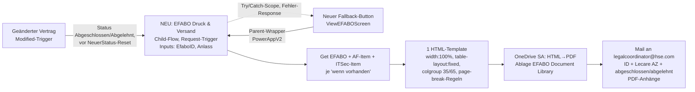

# Diff Anforderungen ↔ Ist-Stand & Umsetzungsplan

> Stand 07.08.2026. Basis: Analyse 01–03, UMSETZUNGSLEITFADEN.md, PROBLEME.md.
>
> **Umsetzungsstand 07.08.2026:** Flow-Seite komplett umgesetzt und als **v1.0.2.0 in DEV importiert**:
> F6-Mapping-Fix (live), ITSec-Block in Child EzP (live), neuer Flow „EFABO Druck und Versand" (`3f8e2d4a-…`, deaktiviert)
> + „[Parent] EFABO Druck und Versand" (`7c4b9e1d-…`, deaktiviert), Auto-Druck-Aufrufe in „Geänderter Vertrag"
> (Cases Abgeschlossen/Abgelehnt), neues Druck-HTML (width 100 %, colgroup 40/60, table-layout fixed, page-break-Regeln,
> AF-Datumsfeld-Bugfix). App-Seite: siehe `ANLEITUNG-CANVAS-APP.md` (User setzt um).

## A. Diff: Anforderung vs. Ist-Stand

| Anforderung | Ist-Stand | Delta |
|---|---|---|
| #1 Drucklayout: volle Breite, größere linke Spalte, keine Überlappung, saubere Umbrüche | 2 Druck-Flows mit HTML-Compose; CSS mit festen px-Breiten (th 100px/td 340px), ITSec zusätzlich `max-width<min-width`-Konflikt, kein `width:100%`, kein `table-layout:fixed`, keine `page-break`-Regeln (F4) | HTML/CSS-Template komplett neu (ein gemeinsames Template) |
| #2 Druck EFABO gesamt (AF+ITSec) ab Status Abgeschlossen/Abgelehnt, für Juristen + SB Legal, Fallback-Button | 2 getrennte Buttons auf Unterformular-Screens, je 1 Flow, Mail an Button-Drücker, `invoker`-Connections, defekte Visible-Logik (F1–F3, F19) | Neuer konsolidierter Flow + neuer Fallback-Button auf Hauptformular/ViewEFABO; alte Buttons + Icons entfernen |
| #3 Auto-Druck + Mail an legalcoordinator@hse.com bei Abschluss/Ablehnung, mit PDF-Anhängen (AF + ITSec wenn vorhanden), Inhalt: EFABO-ID, Kommentar Legal („Lecare AZ"), Text abgeschlossen/abgelehnt | „Geänderter Vertrag" hat Cases „Abgeschlossen"/„Abgelehnt" (nur Info-Mails an Verantwortlichen, kein Druck); Druck-Flows sind nicht child-fähig (PowerAppV2-Trigger) | Druck-Flow als Child (Request-Trigger) bauen; Aufruf in beide Cases **vor** dem NeuerStatus-Reset einhängen |
| #4 Druckbuttons entfernen | Buttons vorhanden (btn_PrintAF, btn_PrintITSec + 4 Icons) | Entfernen; geht in #2 auf |
| Bug B1 (Print sporadisch) | Ursachen gefunden: F1 (kein IfError, leerer Notify) + F3 (AF-Flow scheitert ohne ITSec-Item) + F2 (Visible defekt) | Durch #1–#3 obsolet |
| Bug B2 (Einsatz Software nachträglich) | Ursachen gefunden: F5 (ITSec-Block fehlt im Child EzP; kein Update-Trigger) + F6 (Parent-Mapping gekreuzt) | Fix im Child EzP + Parent-Mapping; Update-Fall klären |
| Bug B3 (Anhang-Upload) | Verdacht: SubmitForm/Patch-Race, Hilfsformulare ohne Item, kein IfError (F9) | Patch-Reihenfolge + IfError |
| Bug B4 (Verlängerung) | Verdacht: toter Button auf ITSec-Screen (F7) + case-sensitive Rollen (F8) | Button entfernen + Lower()-Fix |

## B. Ziel-Architektur Druck (Positionen #1–#3)

Design-Entscheidungen:
- **Ein** neuer Flow „EFABO Druck & Versand" (Request/Child-Trigger `EfaboID`, `Anlass`) statt 2 alte: baut beide PDFs (AF nur wenn AF-Item existiert, ITSec nur wenn ITSec-Item existiert), eine Mail mit beiden Anhängen. Alte Flows CreateHTML_PDF_AF/ITSec bleiben zunächst deaktiviert erhalten (Rollback), Löschung nach GoLive.
- Connections **embedded** auf Service-Account-Connections (`desvc.efabo@hse.com`) – nicht invoker (F19). PDF-Ablage in `hse_EFABO_Document_Library` (auditsicher) statt User-OneDrive/Downloads.
- Fallback-Button: ViewEFABOScreen (Hauptformular), Visible = Arbeitsrechtliche-Prüfungs-Rollen (`varRolleUser in ["Prüfende Rechtsanwälte","Sachbearbeiter Recht"]`) && Status in {Abgeschlossen, Abgelehnt}. OnSelect mit `IfError(...Run(...), Notify(FirstError.Message, Error), Notify(result.message, Success))`.
- Fehlerhandling: Scope „Try" + Scope „Catch" (runAfter Failed/TimedOut) → Fehler-Response an App / Mail an Betreuer-Postfach.

## C. Arbeitspakete

### AP1 – Drucklayout (#1, 2 CS)
1. Neues HTML/CSS-Template (gemeinsam für AF+ITSec): `width:100%; table-layout:fixed; border-collapse:collapse;` + `<colgroup>` 35 %/65 % (linke Spalte größer lt. Anforderung), `word-wrap:break-word; overflow-wrap:anywhere;`, `tr{page-break-inside:avoid}`, Abschnittsüberschriften `th colspan=2`.
2. Feld-Bugs mitfixen: „Ende der Leistungserbringung"-empty-Check (F15), Duplikatfeld `Andere_Softwareloesungen_Zugriff` (F15) – **korrektes Feld beim Kunden erfragen**.
3. Feindesign-Abstimmung mit HSE: Beispiel-PDF erzeugen und **per Mail an Annette Brunner zur Freigabe** (Entscheidung Jan, 07.08.).

### AP2 – Neuer Druck-Flow + App-Umbau (#2, 8 CS)
1. Flow „EFABO Druck & Versand" bauen (siehe B), inkl. Try/Catch + Response.
2. Parent-Wrapper „[Parent] EFABO Druck" (PowerAppV2 → Child) für App-Aufruf.
3. App: neuen Fallback-Button auf ViewEFABOScreen; btn_PrintAF, btn_PrintITSec + Icons (Icon5, Icon5_1–3) entfernen; btn_APVerlängern_1 (tot, F7) entfernen; Lower()-Fix (F8).
4. Connection References auf `desvc.efabo@hse.com` binden (alle 6; Login als SA nötig).

### AP3 – Auto-Trigger + Mail Legal Coordinator (#3, 3 CS)
1. „Geänderter Vertrag": in Cases „Abgeschlossen" + „Abgelehnt" Child-Aufruf „EFABO Druck & Versand" einhängen (**vor** NeuerStatus-Reset).
2. Mail-Empfänger `legalcoordinator@hse.com`; Body: EFABO-ID, Kommentar Legal („Lecare AZ:"), abgeschlossen/abgelehnt (DE, kurz).
3. Klärung P2 (Nachtrag Mail-Variante) parallel anstoßen.

### AP4 – Berechtigungs-Bugfixes (B2, im Zuge der Umsetzung)
1. F6: Parent-Mapping „Berechtigungen ändern" korrigieren (`text`↔`text_2` tauschen) – 5-Min-Fix, großer Effekt.
2. F5: ITSec-Block (Einsatz-Software-Bedingung + PruefungITSec-Patch + Grants) in „[Child] EFABO Entwurf zu Prüfung" ergänzen.
3. Update-Fall „Einsatz Software nachträglich": Empfehlung – beim Speichern in EditEFABOScreen bei Wechsel false→true den Berechtigungs-Child (erweitert) aufrufen. **Aufwand außerhalb Angebot → mit P2 bündeln.**

### AP5 – App-Stabilisierung (B3 + Fehlerbehandlung, teils außerhalb Angebot)
1. F9: Attachment-Patches nach SubmitForm in `OnSuccess` verlagern bzw. IfError + sequenzieren.
2. F16: OnFailure-Handler korrigieren (ViewForm.Error statt EditForm.Error, AF_Form-Notify, NextStatus-Fix).

### AP6 – Test & GoLive (#5, 1,5 CS)
1. DEV: Flow-Status prüfen/aktivieren (F10), Testlauf alle Szenarien (`hse_EFABOTesting=true`).
2. Rückfragen klären: DEVTEST-Flow + Test FLow Anlage löschen (F11/F12)? Testuser raus (F17)?
3. Prod: unmanaged Layer prüfen/entfernen (P1), managed Import, Env-Vars (Testing=false, Site-URLs, Gruppen-IDs), Flows aktivieren, Connection-Ownership SA.

## D. Empfehlung Umsetzungsweg

**Hybrid:**
- **Flows:** Änderungen sind zu groß für JSON-Handedits im Export (neuer Flow + Umbau „Geänderter Vertrag"). Empfehlung: Umsetzung im Maker-Portal (DEV) entlang dieses Plans; kleine chirurgische Fixes (F6-Mapping, HTML-Template austauschen) kann Claude direkt im entpackten JSON machen → pack → import nach Freigabe.
- **Canvas App:** Button-Umbauten + Fixes kann Claude in den .fx.yaml-Sources umsetzen → `pac canvas pack` → Import DEV. Review via Git-Diff.
- Jede Änderung zuerst lokal in Git (Review), dann Import DEV, Test, dann Prod-Deployment gem. AP6.

## E. Offene Fragen an Kunde/intern

1. ~~P2: Nachtrag automatisierte Mail-Variante beauftragt?~~ ✅ **entschieden (Jan, 12.08.): durch Position #3 gedeckt, kein Nachtrag.** Die vier tatsächlich außerhalb liegenden Punkte sind in `Nachtrag-Zusatzleistungen.md` geschätzt (8,5 h + 1,0 h Spec-Termin = 9,5 h) — intern durch Robert Mueller prüfen, dann an HSE.
2. ~~`legalcoordinator@hse.com` als Empfänger~~ ✅ bestätigt (Jan, 07.08.). ~~Fallback-Mail auch an Auslöser?~~ ✅ entschieden (Jan, 07.08.): **zusätzlich an Klicker (CC)** — umgesetzt in Flow-Sources (Child-Input `AusloeserMail`, Parent reicht durch, App übergibt `User().Email`); ab v1.0.2.1.
3. ~~Korrektes Feld für ITSec-Frage „Haben Dienstleister Zugriff…" (F15-Duplikat)?~~ ✅ **selbst geklärt (12.08.), keine Kundenrückfrage nötig:** korrektes Feld ist `DL_Zugriff_auf_Software_Daten`, ermittelt aus den Formularbindungen der App (`coauthoring/ITSecurityFreigabenScreen.pa.yaml`: `DataField "DL_Zugriff_auf_Software_Daten"` Z. 2306, separates Feld `DataField "Andere_Softwareloesungen_Zugriff"` Z. 2474). Fix im neuen Flow `EFABO Druck und Versand` angewendet, in `EFABO_1.0.2.1_flowsonly.zip` enthalten. Der alte `CreateHTML_PDF_ITSec` bleibt unangetastet (Löschkandidat).
4. ~~DEVTEST-Flow + „Test FLow Anlage" löschen? Testuser entfernen (F17)?~~ ✅ entschieden (Jan, 07.08.): **vorerst nichts löschen** — erst nach vollständigem DEV-Test wieder aufgreifen (GoLive-Vorbereitung).
5. ~~B3/AP5 (Upload-Stabilisierung) im Budget?~~ ✅ entschieden (Jan, 11.08.): **Minimal-Fix wird mitgemacht** (aus Restbudget, ~1 h) — Patch → `Form.OnSuccess` + `IfError` an den 4 Absende-Buttons, Rest nur dokumentiert. Spezifikation: `ANLEITUNG-CANVAS-APP.md` 2.5. Timing: nach Smoke-Test Teil 0/1. Ideen-Teil (Reminder, Infomails) weiterhin nur nach Zusatzfreigabe.
